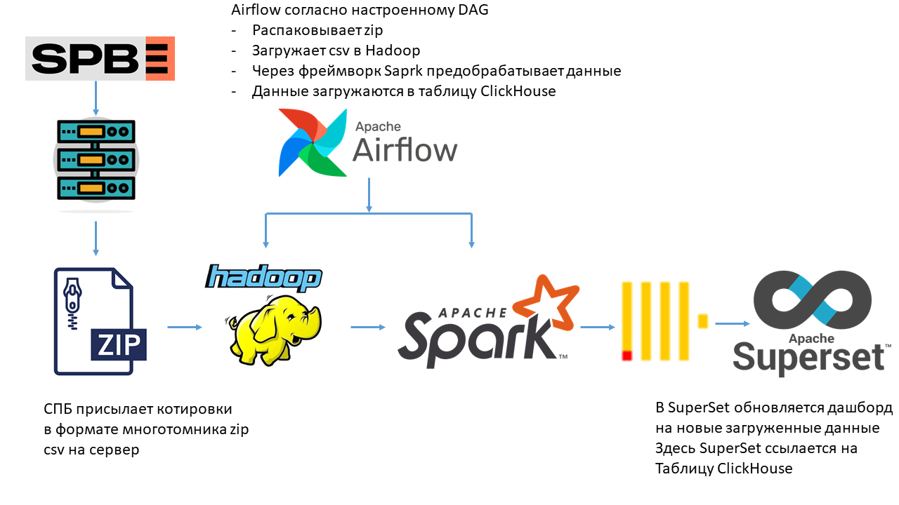
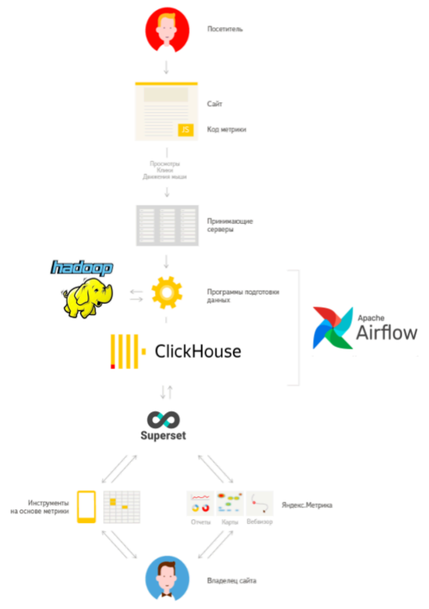

## Задание 1: Проектирование хранилища данных
Спроектировать хранилище данных и ETL процесс для одной из типовых архитектур

**Срок:** занятие "Основы SQL"

**Примерное время выполнения:** 2ч

## Примеры:

**Котировки биржи**

**Яндекс Метрика** — это инструмент веб-аналитики, который помогает получать наглядные отчеты, записи действий посетителей, отслеживать источники трафика и оценивать эффективность онлайн- и офлайн-рекламы.

**Важно!** Потенциально система должна работать с большим объемом данных

Можно выбрать либо одну из перечисленных предметных областей (систем) или любую другую.

Предусмотреть:
- источники данных (какие будут, как данные будут загружаться?)
- преобразования
- какие данные храним? Как извлекаем и анализируем?
- какие инструменты/сервисы используем для визуализации, поиска, извлечения данных?

## Примеры предметных областей:
- Ваш рабочий проект
- Yandex.Metrica: Сервис веб-аналитики Yandex.Metrica использует ClickHouse для обработки и анализа больших объемов данных о посещениях сайтов, действиях пользователей и других метриках.
- Avito: Крупнейшая онлайн-площадка для объявлений Avito использует ClickHouse для анализа данных о продажах, поисковых запросах пользователей и других параметрах для оптимизации пользовательского опыта и бизнес-процессов.
- Cloudflare: Компания Cloudflare использует ClickHouse для обработки и анализа данных о сетевом трафике, DDoS-атаках и других событиях, что помогает обеспечить безопасность и производительность интернет-сервисов.
- Wargaming: Разработчик игр Wargaming использует ClickHouse для анализа игровых данных, таких как статистика боев, поведение игроков и экономические показатели, для оптимизации игрового баланса и улучшения игрового опыта.
- Badoo: Социальная сеть Badoo использует ClickHouse для анализа данных о взаимодействии пользователей, мессенджере и других активностях на платформе для улучшения социального опыта.
- Kenshoo: Kenshoo, компания в области управления и оптимизации рекламных кампаний, использует ClickHouse для анализа рекламных данных, чтобы оптимизировать расходы и улучшить результаты кампаний.
- BlaBlaCar: BlaBlaCar, платформа для совместных поездок, использует ClickHouse для анализа данных о поездках, запросах пользователей и других факторов для улучшения предложения и оптимизации процессов.

## Результат:
- диаграмма (визуализация) архитектуры
- текстовое описание
