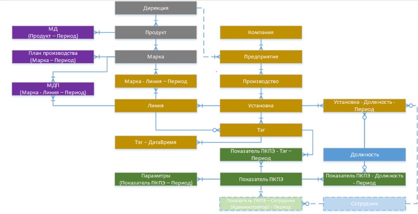
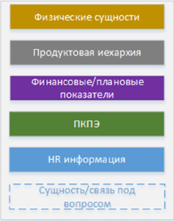

## Задание 2: DDL и DML
Создать базу данных hr-отдела компании (создание таблиц и связей)

**Срок:** занятие "Агрегирующие запросы"

**Примерное время выполнения:** 4ч

Большая компания хочет структурировать информацию о своей деятельности и решила создать СУБД для хранения данных. Начать решили с hr-отдела.

Предметная область деятельности компании примерно изображена рисунке:

где:

  ## Этап 1: концептуальное моделирование

Спроектировать ER-диаграмму предметной области:
- есть сотрудники компании (ФИО, адрес, возраст, номер паспорта)
- есть роли сотрудников (менеджер, тимлид), у менеджера в подчинении могут быть другие сотрудники
- есть справочник должностей с разбивкой на категории (у каждой категории своя вилка ЗП), есть грейды (junior, middle, senoir, lead)
- у каждого сотрудника своя ЗП, эту информацию тоже нужно сохранить
- в рамках компании есть несколько отделов, у каждого отдела есть свой руководитель (обязательно с ролью менеджер). Сотрудники могут работать в один момент времени только в одном отделе.

Дополнительно (задание со *):
- компания состоит из филиалов
- у филиала есть свой ИНН
- в компании есть несколько продуктовых команд, в каждой команде могут работать сотрудники из нескольких отделов (например: команда состоит из разработчиков, тестировщиков, дизайнеров)
- сотрудник может находиться в отпуске, больничном или работать
- на месяц есть штатное расписание для каждого сотрудника
- по итогам года сотрудник может получать премию

## Этап 2: переход от концептуальной модели к физической:

  - Перенести сущности и свзяи в таблицы в БД PostgreSQL
  - Выполнить нормализацию отношений

## Критерии оценки:
- ссылка на ER-диаграмму в draw.io, на диаграмме отображены сущности, атрибуты и связи из предметной области. Для свзяей указана кратность.
- ссылка на db-fiddle с DDL таблиц, созданных на основе ER-диаграммы.
- нормализация данных: 3-я НФ
- таблицы соединены внешними ключами, есть адекватные constraints и PK в таблицах
